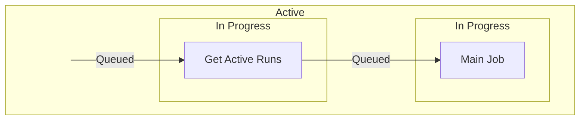

# About
GitHub runs actions in parallel which can cause problems when two instances of the same action run at the same time. This workflow fails the current action if the same action is already running

# Overview
The workflow contains 2 jobs, the first checks for existing runs and the second executes the main job which fails if there are existing runs found.

## Get Active Runs - 1st Job
In this job, we get the workflow_id, which is used to find the same actions, by using the ["Get a workflow run"](https://docs.github.com/en/rest/actions/workflow-runs?apiVersion=2022-11-28#get-a-workflow-run) endpoint. We then look for runs which are queued and in progress through the ["List workflow runs for a repository"](https://docs.github.com/en/rest/actions/workflow-runs?apiVersion=2022-11-28#list-workflow-runs-for-a-repository) endpoint. A script is run that checks the current run number against the active runs' run numbers and if there is a mismatch, we know that there is an existing run other than the current one.

## Main Job - 2nd Job
Using the result from the previous job, we can force a fail for this job if there are active runs and send an email to the pusher informing them that the action has been forced to fail. If no active runs were found, this job can continue.

# Methodology
## Run status
When listing the workflow runs for a repository, each workflow run has a status of which we are only interested in the queued and in progress statuses. We need workflows which are queued becauses they are also active runs.

In the diagram below, we can see that while a job is waiting for a runner, the status of the workflow is queued.

This means that if the second action happens to list workflows while the first action is in between jobs, the first workflow will not be returned if only listing in progress workflows.

## Active Runs
To get all active runs, we list all workflows which are queued and in progress with cURL commands. We are only interested in the run number of the workflows which we append to a text file.

A script then compares the list of run numbers with the run number of the current workflow which tells us if there are other active runs.

# Scenarios

One with in progress run

One with completed runs

# References
## API Docs
https://docs.github.com/en/rest/actions/workflow-runs?apiVersion=2022-11-28#get-a-workflow-run

https://docs.github.com/en/rest/actions/workflow-runs?apiVersion=2022-11-28#list-workflow-runs-for-a-repository