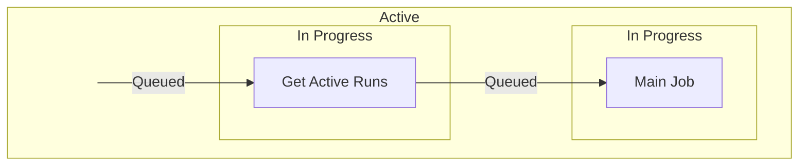

# About
GitHub runs actions in parallel which can cause problems when two instances of the same action run at the same time. This workflow fails the current action if the same action is already running

# Overview
The workflow contains 2 jobs, the first checks for existing runs and the second executes the main job which fails if there are existing runs found.

## Get Active Runs - 1st Job
In this job, we get the workflow_id, which is used to find the same actions, by using the ["Get a workflow run"](https://docs.github.com/en/rest/actions/workflow-runs?apiVersion=2022-11-28#get-a-workflow-run) endpoint. We then look for runs which are queued and in progress through the ["List workflow runs for a repository"](https://docs.github.com/en/rest/actions/workflow-runs?apiVersion=2022-11-28#list-workflow-runs-for-a-repository) endpoint. A script is run that checks the current run number against the active runs' run numbers and if there is a run number within the list that is less than the current run number, we know that there is an active run that started before the current one.

## Main Job - 2nd Job
Using the result from the previous job, we can force a fail for this job if there are active runs and send an email to the pusher informing them that the action has been forced to fail. If no active runs were found, this job can continue.

# Methodology
## Run status
When listing the workflow runs for a repository, each workflow run has a status of which we are only interested in the queued and in progress statuses. We need workflows which are queued becauses they are also active runs.

In the diagram below, we can see that while a job is waiting for a runner, the status of the workflow is queued.

This means that if the second action lists workflows while the first action is in between jobs, the first action will not be returned if only listing in progress workflows. This is why we also include queued workflows under active runs. 

## Active Runs
To get all active runs, we list all workflows which are queued and in progress with cURL commands. We are only interested in the run number of the workflows which we append to a text file.

A script then compares the list of run numbers with the run number of the current workflow. If the list of run numbers contains a number less than the run number of the current run, it tells us that there is an active run that started before the current one.

[Potential issue with the bash script](#bash-script-when-checking-for-active-runs)

# Scenarios
### Scenario A - No Other Active Runs
Assume workflow 50 is started alone. Within the first job, we list workflows with a queued or in progress status. There will be no output when listing workflows with a queued status while workflow 50 will be listed under workflows with an in progress status as it is running this job currently. When the bash script is executed, 50 is the only run number in the list of all runs which is compared against the current run number, 50. Since there are no run numbers in the list lower than the current run number, it is determined that there are no preceding active runs and thus the second job will not fail.

### Scenario B - Preceding Active Run
Assume workflow 50 is started and workflow 51 starts after workflow 50 has finished its first job. When workflow 50 runs, just like the previous example, it will be determined that there are no preceding active runs. When the first job of workflow 51 runs, workflow 51 will be listed as in progress while workflow 50 could either be queued or in progress, depending on whether workflow 50 has started its second job. Regardless of workflow 50's status, the list of all runs will contain both 50 and 51. When the bash script is executed, both numbers are compared against the current run number, 51. As there is a number in the list lower than the current run number, it is determined that there is a preceding active run and thus the second job will fail.

### Scenario C - Following Active Run
Assume workflow 50 is started and workflow 51 starts right after workflow 50. The flow of workflow 51 still follows the previous example but there are some differences for workflow 50. Since workflow 51 was started right after workflow 50, when workflow 50 is listing workflows, workflow 51 might be listed under queued or in progress, depending on whether it has started its first job. The list of all runs will therefore contain both 50 and 51. The bash script will then compare the list and the current run number, 50. However, since the list does not contain a lower run number than the current one, it is determined that even though there is another active run it does not precede the current one and thus the second job will not fail.

# Potential Issues
### Bash script when checking for active runs
There can be a problem if somehow the run numbers are out of order *e.g. the workflow with run number 51 runs before the workflow with run number 50*. If the second workflow doesn't get queued or start before the first checks for active workflows, the first workflow will not fail meaning both will run. If this is an issue that can occur, the script should check for a mismatch instead.

However, when checking for a mismatch, there can also be an issue if the run numbers are in order and the workflows are triggered close together. In this case, when the first workflow checks for active runs, the second workflow is already queued which causes the first workflow to fail. The second workflow can also fail if it checks for active runs before the first workflow terminates. This can result in both workflows failing.